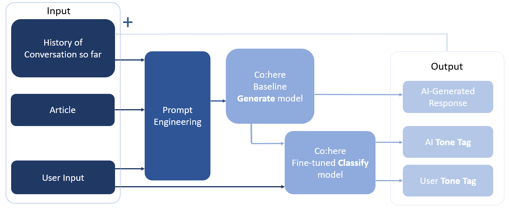
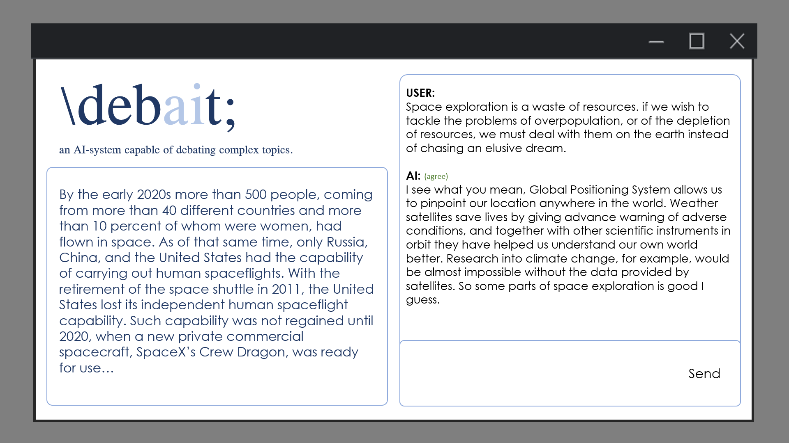
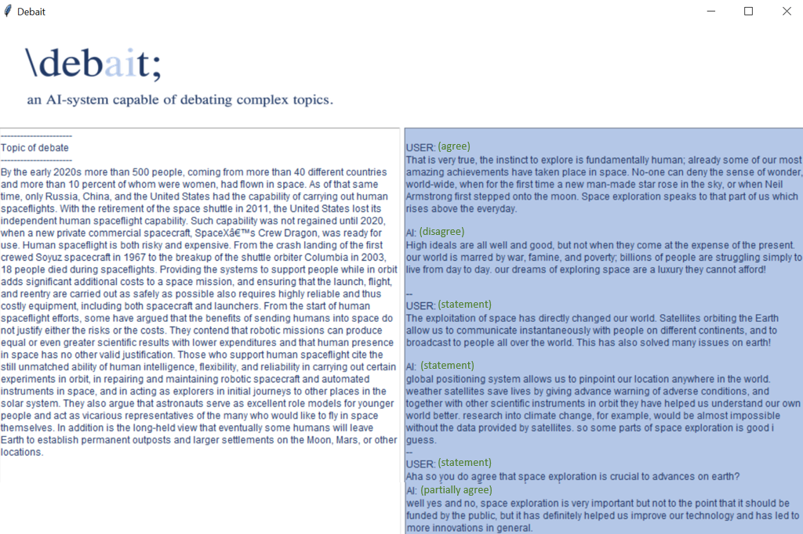

---
This project was build as part of the Cohere AI 48-hour Hackathon #3

### Introduction

- Debait is a Conversational AI designed to debate about an article/topic of your choice.
- It uses Co:here’s Generate and Classify models
- With a bit of prompt engineering, history modelling and classification we can obtain a very powerful output from Co:here’s model!

### Getting Started

1. Clone this repo
2. Add an ``api_key.txt`` with your API KEY from [co:here](https://os.cohere.ai/login?presetId=1b7d097c-bd43-4bf9-9300-86ea08b0c248).
3. Creat an environment on Python 3 and install the packages from the ``requirements.txt`` file
3. To start the application run ``main.py``

### Co:here and LabLab

- Find out more about [co:here](https://cohere.ai/).
- My LabLab [profile](https://lablab.ai/u/@Vinush).

### Building Debait (model framework and GUI mock-up)

### Applications of Debait

1. Fake News – Help prevent polarising users through social media exposure
2. Education – Help develop ideas, expand students’ critical thinking skills, articulation, research skills, and resolution of conflict.
3. Content Generation for Media -  Articles, magazines and blogs can use Debait to generate content and ideas.

### Improvements

1. Better GUI and Faster AI Response
2. Fine-tuning the Co:here Generate model and using more data for Co:here Classify
3. Allow user to control the tone and length of the response from the AI
4. Show more metrics with response to move towards explainable AI

### Debait in action

